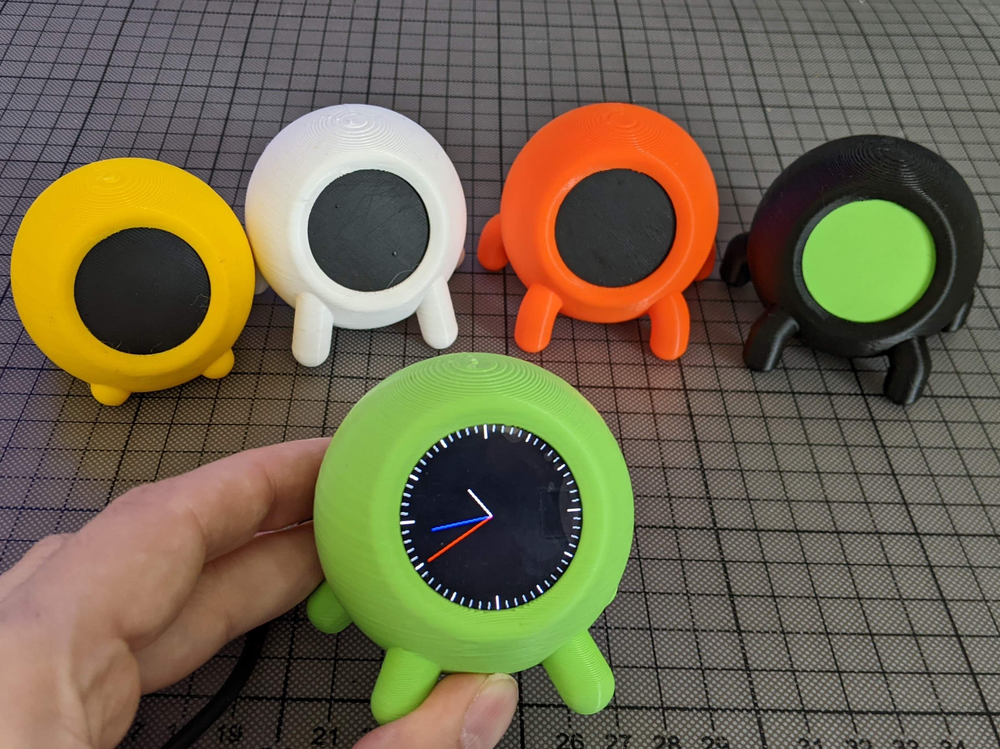

# GC9A01-xiao-ESP32C3
Code for Waveshare GC9A01 and Seeed Studio XIAO ESP32C3

Components:
- [Waveshare 240×240, 1.28inch LCD Display Module](https://www.waveshare.com/1.28inch-lcd-module.htm) Embedded GC9A01 Driver, Using SPI Bus
- [Studio XIAO ESP32C3](https://www.seeedstudio.com/Seeed-XIAO-ESP32C3-p-5431.html) tiny MCU board with Wi-Fi and Bluetooth5.0, battery charge supported, power efficiency and rich Interface

Support me: [Buy Me A Coffee](https://www.buymeacoffee.com/printminion)

# Demos
* [Arduino_GFX](Arduino_GFX) library
* [LVGL](LVGL)
* [TFT_eSPI](TFT_eSPI) [TFT_eSPI](TFT_eSPI) library

# 3d printed case
Enclosure for [Waveshare Round](https://www.waveshare.com/1.28inch-lcd-module.htm) *(240x240 pixels)* and [Studio XIAO ESP32C](https://www.seeedstudio.com/Seeed-XIAO-ESP32C3-p-5431.html).

[collection of cases for this screen](https://cults3d.com/en/design-collections/printminion/various-cases-for-waveshare-1-28inch-lcd-display-and-studio-xiao-esp32c3)

Check out videos
- Disassembly *coming soon*
- Assembly *coming soon*

.png)
.png)
.png)
-back.png)
.png)
.png)
.png)

* print case by yourself [cults3d](https://cults3d.com/en/design-collections/printminion/various-cases-for-waveshare-1-28inch-lcd-display-and-studio-xiao-esp32c3)
* get case on [shapeways](https://www.shapeways.com/shops/printminion)
* follow me on Twitter [@printminion](https://twitter.com/printminion)

